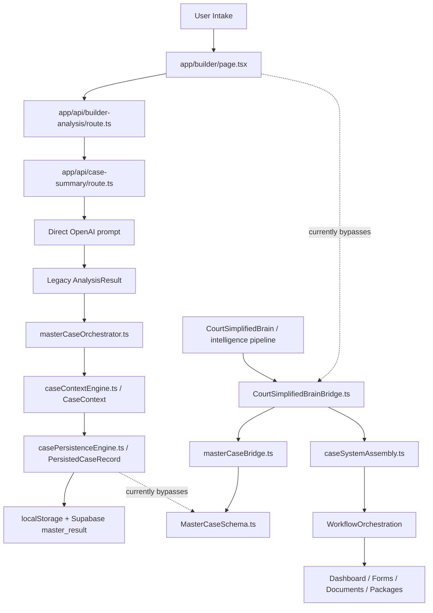

# COURTSIMPLIFIED CLUSTER CONNECTION MAP V1

## Scope
Combined project built from uploaded ZIPs: `app/` from source audit and `src/` from project source snapshot.

- Code files parsed: 160
- Resolved internal imports: 275
- Unresolved relative imports: 1
- External package imports: 96

## Cluster counts

| Cluster | Files |
|---|---:|
| Legacy/other engines | 44 |
| Workflow pages | 22 |
| API routes | 15 |
| Intelligence | 12 |
| Evidence/proof | 11 |
| Authority/rules | 11 |
| Builder intake | 9 |
| Documents/drafting | 8 |
| Forms | 6 |
| Dashboard | 4 |
| Persistence/storage | 4 |
| Workflow orchestration | 4 |
| Contradiction | 3 |
| Other | 2 |
| Bridges/contracts | 2 |
| Credibility | 2 |
| MasterCase architecture | 1 |

## Main architecture diagram

## Cluster-to-cluster import map

| From cluster | To cluster | Imports |
|---|---|---:|
| Legacy/other engines | Legacy/other engines | 65 |
| Intelligence | Intelligence | 18 |
| Legacy/other engines | Evidence/proof | 17 |
| Authority/rules | Authority/rules | 13 |
| Legacy/other engines | MasterCase architecture | 12 |
| Builder intake | Builder intake | 10 |
| Workflow pages | Persistence/storage | 8 |
| Forms | Legacy/other engines | 7 |
| Legacy/other engines | Workflow orchestration | 7 |
| Evidence/proof | Legacy/other engines | 6 |
| Evidence/proof | Evidence/proof | 6 |
| Documents/drafting | Legacy/other engines | 6 |
| Authority/rules | Legacy/other engines | 6 |
| Workflow orchestration | Legacy/other engines | 5 |
| Workflow pages | Documents/drafting | 4 |
| Dashboard | Dashboard | 4 |
| Workflow pages | Evidence/proof | 4 |
| Documents/drafting | Documents/drafting | 4 |
| Legacy/other engines | Forms | 4 |
| Bridges/contracts | Authority/rules | 4 |
| Evidence/proof | MasterCase architecture | 4 |
| Builder intake | Legacy/other engines | 3 |
| Workflow pages | Legacy/other engines | 3 |
| Persistence/storage | Legacy/other engines | 3 |
| Legacy/other engines | Documents/drafting | 3 |
| Contradiction | Contradiction | 3 |
| Intelligence | Legacy/other engines | 3 |
| API routes | Intelligence | 2 |
| Dashboard | Persistence/storage | 2 |
| Forms | Workflow orchestration | 2 |
| Forms | Forms | 2 |
| Authority/rules | Forms | 2 |
| Bridges/contracts | Contradiction | 2 |
| Contradiction | MasterCase architecture | 2 |
| Credibility | MasterCase architecture | 2 |
| Legacy/other engines | Authority/rules | 2 |
| Legacy/other engines | Intelligence | 2 |
| Legacy/other engines | Credibility | 2 |
| Workflow orchestration | MasterCase architecture | 2 |
| API routes | Authority/rules | 1 |
| Builder intake | Persistence/storage | 1 |
| Builder intake | Evidence/proof | 1 |
| Builder intake | Intelligence | 1 |
| Persistence/storage | Evidence/proof | 1 |
| Persistence/storage | Documents/drafting | 1 |
| Workflow orchestration | Evidence/proof | 1 |
| Dashboard | Legacy/other engines | 1 |
| Documents/drafting | Evidence/proof | 1 |
| Evidence/proof | Workflow orchestration | 1 |
| Evidence/proof | Forms | 1 |
| Legacy/other engines | Persistence/storage | 1 |
| Bridges/contracts | MasterCase architecture | 1 |
| Bridges/contracts | Intelligence | 1 |
| Credibility | Credibility | 1 |
| Intelligence | Builder intake | 1 |
| Authority/rules | MasterCase architecture | 1 |
| Legacy/other engines | Bridges/contracts | 1 |
| Workflow orchestration | Workflow orchestration | 1 |

## Highest connection files

| File | Cluster | Called by | Imports | Total degree |
|---|---|---:|---:|---:|
| `src/lib/case-system/architecture/masterCaseSchema.ts` | MasterCase architecture | 24 | 0 | 24 |
| `src/lib/case-system/caseContextEngine.ts` | Legacy/other engines | 14 | 3 | 17 |
| `src/lib/case-system/orchestration/caseSystemAssembly.ts` | Legacy/other engines | 1 | 15 | 16 |
| `src/lib/case-system/evidenceEngine.ts` | Evidence/proof | 15 | 0 | 15 |
| `src/lib/case-system/types/family-case.ts` | Legacy/other engines | 12 | 0 | 12 |
| `src/lib/case-system/civilMasterCaseEngine.ts` | Legacy/other engines | 2 | 9 | 11 |
| `src/lib/case-system/types/index.ts` | Legacy/other engines | 1 | 9 | 10 |
| `src/lib/case-system/rulesEngine.ts` | Authority/rules | 1 | 9 | 10 |
| `src/lib/case-system/types/case.ts` | Legacy/other engines | 9 | 0 | 9 |
| `src/lib/case-system/types/civil-case.ts` | Legacy/other engines | 7 | 2 | 9 |
| `src/lib/case-system/contracts/masterCaseBridge.ts` | Bridges/contracts | 1 | 8 | 9 |
| `app/builder/page.tsx` | Builder intake | 0 | 9 | 9 |
| `src/lib/case-system/familyAiIntakeNormalizer.ts` | Legacy/other engines | 7 | 1 | 8 |
| `src/lib/case-system/familyWorkflowEngine.ts` | Workflow orchestration | 5 | 3 | 8 |
| `src/lib/case-system/familyFormRoutingEngine.ts` | Forms | 4 | 4 | 8 |
| `src/lib/case-system/familyEvidenceEngine.ts` | Evidence/proof | 3 | 5 | 8 |
| `src/lib/case-system/intelligence/courtSimplifiedBrain.ts` | Intelligence | 2 | 6 | 8 |
| `src/lib/case-system/familyMasterCaseEngine.ts` | Legacy/other engines | 0 | 8 | 8 |
| `src/lib/case-system/intelligence/intelligenceTypes.ts` | Intelligence | 7 | 0 | 7 |

| `src/lib/case-system/authority/authoritySourceSchema.ts` | Authority/rules | 7 | 0 | 7 |
| `src/lib/case-system/familyStrategyEngine.ts` | Legacy/other engines | 6 | 1 | 7 |
| `src/lib/case-system/documentWorkspaceEngine.ts` | Documents/drafting | 6 | 1 | 7 |
| `src/lib/case-system/familyAffidavitNarrativeEngine.ts` | Legacy/other engines | 1 | 6 | 7 |
| `src/lib/supabase/client.ts` | Persistence/storage | 6 | 0 | 6 |
| `src/lib/legal-intelligence/core/caseModel.ts` | Intelligence | 6 | 0 | 6 |
| `src/lib/case-system/utils.ts` | Legacy/other engines | 6 | 0 | 6 |
| `app/builder/_components/builderTypes.ts` | Builder intake | 6 | 0 | 6 |
| `src/lib/case-system/caseContextStorage.ts` | Persistence/storage | 5 | 1 | 6 |
| `src/lib/case-system/civilWorkflowEngine.ts` | Workflow orchestration | 3 | 3 | 6 |
| `src/lib/case-system/documentGenerationEngine.ts` | Documents/drafting | 2 | 4 | 6 |
| `src/lib/legal-intelligence/core/aiOrchestratorTypes.ts` | Intelligence | 1 | 5 | 6 |
| `src/lib/case-system/masterCaseOrchestrator.ts` | Legacy/other engines | 1 | 5 | 6 |
| `src/lib/case-system/familyCaseFileCatalogEngine.ts` | Legacy/other engines | 1 | 5 | 6 |
| `app/evidence/page.tsx` | Workflow pages | 0 | 6 | 6 |
| `src/lib/case-system/dashboardEngine.ts` | Dashboard | 3 | 2 | 5 |
| `src/lib/case-system/authority/authorityWeightEngine.ts` | Authority/rules | 3 | 2 | 5 |
| `src/lib/case-system/authority/authorityVerificationEngine.ts` | Authority/rules | 3 | 2 | 5 |
| `src/lib/case-system/courtPackageAssemblyEngine.ts` | Legacy/other engines | 2 | 3 | 5 |
| `src/lib/case-system/civilEvidenceEngine.ts` | Evidence/proof | 2 | 3 | 5 |
| `src/lib/case-system/authority/citationSafetyEngine.ts` | Authority/rules | 2 | 3 | 5 |
| `src/lib/case-system/orchestration/courtSimplifiedBrainBridge.ts` | Legacy/other engines | 1 | 4 | 5 |
| `src/lib/case-system/casePersistenceEngine.ts` | Persistence/storage | 1 | 4 | 5 |
| `src/lib/case-system/timelineEngine.ts` | Legacy/other engines | 3 | 1 | 4 |
| `src/lib/case-system/legalTheoryEngine.ts` | Legacy/other engines | 3 | 1 | 4 |
| `src/lib/case-system/evidenceStorage.ts` | Evidence/proof | 3 | 1 | 4 |
| `src/lib/case-system/knowledge/legalKnowledgeObjects.ts` | Legacy/other engines | 2 | 2 | 4 |
| `src/lib/case-system/contradictions/contradictionDetectionEngine.ts` | Contradiction | 2 | 2 | 4 |
| `src/lib/case-system/litigationStrategyEngine.ts` | Legacy/other engines | 1 | 3 | 4 |
| `src/lib/case-system/knowledge/knowledgeRetrievalEngine.ts` | Legacy/other engines | 1 | 3 | 4 |
| `src/lib/case-system/contradictions/credibilityRiskEngine.ts` | Contradiction | 1 | 3 | 4 |

## Current verified split

### Legacy operational path
`Builder -> builder-analysis -> case-summary -> AnalysisResult -> masterCaseOrchestrator -> CaseContext -> casePersistenceEngine -> localStorage/Supabase`

### Target master path
`LegalIntelligenceResult -> CourtSimplifiedBrainBridge -> masterCaseBridge -> MasterCaseSchema + CaseSystemAssembly -> WorkflowOrchestration`

## Immediate conclusion
The first migration must connect the intake/API entrypoint to the target master path before persistence is rewritten. Otherwise persistence would only store better-shaped legacy output.
